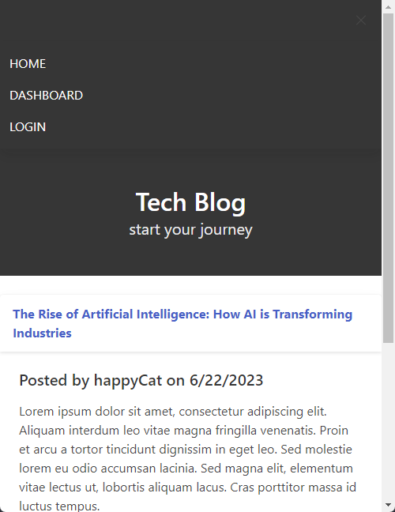

# Personal Finance Tracker: Cash Cow

 

## Description

The aim of this web-based platform is to create a space where users can connect, interact, and exchange information on various tech-related topics, fostering a sense of community among like-minded individuals.

 

## Table of Contents

- [Description](#description)
- [Table of Contents](#table-of-contents)
- [Demonstration](#demonstration)
- [Deployed Webpage](#deployed-webpage)
- [Technology](#technology)
- [Installation](#installation)
- [Credits](#credits)
- [License](#license)

 

## Demonstration

Application Demonstration:\
Watch it on [Google Drive](https://drive.google.com/file/d/1KiTD95_KYZ0TWVCVoD6M32Z7appLgXcG/view)🖥️

Application Preview:

## Deployed Webpage

Click on the computer [🖥️](https://techy-bloggy-d7f528e7d6af.herokuapp.com/) to visit the site.

 

## Technology

The application utilizes a range of technogies to delivere its functionality. These include:

- Back-End Technologies:

  - Node.js
  - Express

- Front-End Technology:

  - Bulma

- Templating Engine:

  - Handlebars

- Database:

  - MySQL

- Object-Relational Mapping

  - Sequelize

- Environmental Variables:

  - Dotenv

- Encryption:

  - Bcrypt

- Deployment:

  - Heroku

 

## Installation

No installation prerequisites are necessary.

 

## Credits

To enhance the visual appeal of the webpage, the application integrated an external resource called Bulma. Additionally, it utilizes a range of dependencies including Node.js, Express, Handlebars, dotenv, sequelize, mysql, and bcrypt to effectively operate the server.

 

## License

Please refer to the [LICENSE](https://github.com/ronachen99/tech-blog/blob/main/LICENSE) document.

